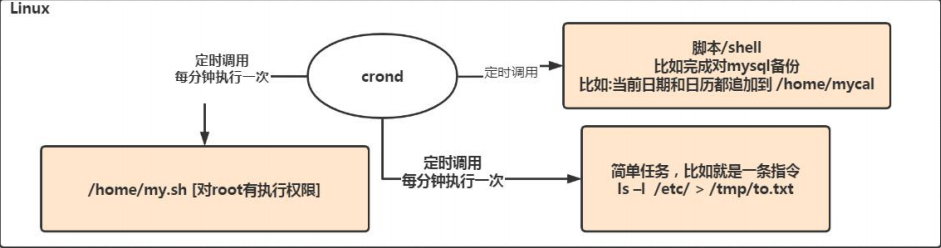
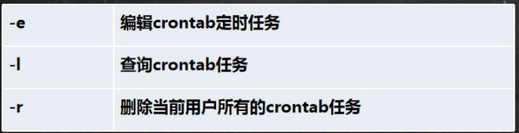
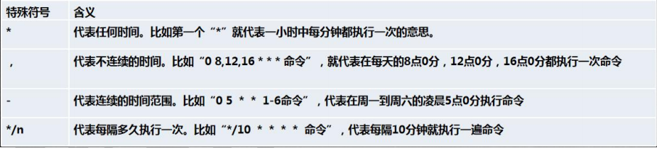
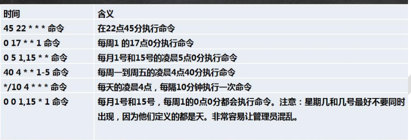

---
title： Linux相关内容
---
#Linux基础知识

## Linux的目录结构

- Linux只有一个根目录 /

- Linux的世界中，一切都是文件

- 层级的目录结构：

  

  1)  root : 该目录为系统管理员目录，root是具有超级权限的用户。

  **2)  bin ->usr/bin : 存放系统预装的可执行程序，这里存放的可执行文件可以在系统的任何目录下执行。**

  3)  usr是linux的系统资源目录，里边存放的都是一些系统可执行文件或者系统以来的一些文件库。

  **4)  usr/local/bin：存放用户自己的可执行文件，同样这里存放的可执行文件可以在系统的任何目录下执行。**

  5)  lib->usr/lib: 这个目录存放着系统最基本的动态连接共享库，其作用类似于Windows里的DLL文件，几乎所有的应用程序都需要用到这些共享库。

  6)  boot : 这个目录存放启动Linux时使用的一些核心文件，包括一些连接文件以及镜像文件。

  7)  dev: dev是Device(设备)的缩写, 该目录下存放的是Linux的外部设备，Linux中的设备也是以文件的形式存在。

  **8)  etc: 这个目录存放所有的系统管理所需要的配置文件**。

  **9)  home：用户的主目录，在Linux中，每个用户都有一个自己的目录，一般该目录名以用户的账号命名，叫作用户的根目录；用户登录以后，默认打开自己的根目录。**

  10) var : 这个目录存放着在不断扩充着的东西，我们习惯将那些经常被修改的文件存放在该目录下，比如运行的各种日志文件。

  11) mnt : 系统提供该目录是为了让用户临时挂载别的文件系统，我们可以将光驱挂载在/mnt/上，然后进入该目录就可以查看光驱里的内容

  **12)  opt: 这是给linux额外安装软件所存放的目录。比如你安装一个Oracle数据库则就可以放到这个目录下，默认为空。**

  13)  tmp: 这个目录是用来存放一些临时文件的。

  ## Linux的远程操作

  1)、Xshell：linux的终端模拟软件。（解决了远程使用终端的问题）
          安装并破解：解压、破解(运行两个.bat文件)、启动(Xshell)
  	连接远程linux系统：创建会话：
  	            查看linux系统的ip地址：ifconfig
  2)、Xftp：文件传输软件。（解决了linux和本机文件的相互传输）
          安装并破解：解压、破解(运行两个.bat文件)、启动(Xftp)
  	连接远程linux系统：创建会话：
  	            查看linux系统的ip地址：ifconfig

  ## vim和vi的相关操作

  1. vi和vim是linux的中文编辑器，用来在linux中创建，查看或者编辑文本文件，就好像windows中的记事本一样。vim是vi的增强版本，vi的绝大多数用法在vim都适用。
  2. vi和vim的使用
     1. **一般模式**：用vi或者vim命令打开文件(vim test.txt)，进入一般模式，可以查看文件的内容，并且通过上下左右键移动光标，查看文件的某一部分；但是不能编辑文件
     2. **编辑模式：**在一般模式下，按i或者a键进入编辑模式，在编辑模式中可以编辑文件内容，但是不能保存编辑的内容，按Esc，回到一般模式
     3. **命令行模式**: 在一般模式下，按shift+：进入命令行模式
        1. q!---------不保存强制退出编辑器
        2. wq---------保存并且退出编辑器
        3. q------------只是退出编辑器
     4. **vi和vim编辑器的快捷键**
        1. 复制当前行：在一般模式下按yy，把光标所在行复制到剪切板，按p将内容粘贴到光标所在的下一行
        2. 复制多行：在一般模式下，按5yy，将光标所在行往下5行复制到剪切板，按p，把剪切板中的内容粘贴到光标所在的下一行
        3. 在文本文件中查找关键字：在命令行模式下熟输入 `/关键字`，回车，按n表示光标查找下一个关键字
        4. 删除光标所在的当前行：在一般模式下按dd，删除光标所在的当前行
        5. 删除光标所在的行往下5行：在一般模式下，按5dd
        6. 撤销上次编辑的内容：在一般模式下，按u
        7. 显示行号：命令行模式下，设置文件的行号，取消文件的行号.[命令行下`(: set nu) 和(:set nonu)]`

## Linux中的用户管理

1. 任何使用linux的系统资源的用户，必须使用一个合法的账号和密码，账号和密码一般都是向系统管理员申请。
    root是linux系统安装时默认创建的系统管理员账号，由root创建普通账号。

2. 添加用户：useradd 【选项】用户名

   1. useradd kyrie
   2. 在/home目录下创建用户的根目录，目录名默认和用户名相同
   3. 在linux中任何一个用户都至少属于一个组，新建用户时如果不指定组，则会新建一个组，组名和用户名相同，并且把该用户添加到该组中
   4. useradd -d /home/ww wangwu  创建wangwu用户的同时，指定用户的根目录
   3. 给用户设置密码：password 用户名

      1. password kyrie
   4. 删除用户：userdel 用户名（只删除了用户，没有删除他的主目录 ）
   
      1. userdel kyrie ：删除用户，保留了主目录
      2. userdel -r kyrie ：删除用户的同时删除了它的主目录
   5. 查看用户信息：id 用户名
   
      1. id kyrie
   6. 切换用户名：su 用户名
   
      1. su kyrie
      2. 从权限高的用户切换权限低的用户，不需要密码验证；
      3. 从权限低的用户切换到权限高的用户，必须密码验证。
   9. 查看当前登录用户： whoami / who am i

   ## Linux中的组管理
   
   1. linux中的组相当于角色的概念，可以对有共性的用户进行统一管理
   2. 每一个用户至少属于一个组，不能独立于组的存在，也可以属于多个组
      1. 新建用户时如果不指定组，则会新建一个组，组名跟用户名相同，并且把该用户添加到该组中。
   3. 添加组 groupadd 组名
   4. 删除组 groupdel 组名
   5. 把用户添加到组中 gpasswd -a 用户名 组名
      1. gpassword -a zhangsan dev 将zhangsan添加到了dev这个组当中
   6. 把用户从组中移除：gpasswd -d 用户名 组名
      1.  gpasswd -d zhangsan dev
   7. 添加用户时，指定所属的组(主组)：useradd -g 组名 用户名
      1. useradd -g dev lisi
   
   ## Linux中的系统操作命令
   
   1. 关机：shutdown now 立即关机
      1. shutdown -h xxx(单位分钟) 定时关机
      2. shutdown -r now 立即重启
   2. 重启:reboot 立即重启
   3. 同步数据库：sync
   3. 在进行关机的时候应该先同步数据库信息，然后再进行关机
   
   ## Linux中的帮助命令
   
   1. 用来查看linux系统手册上的帮助信息：man 命令
             man ls
             分屏显示、按回车翻一行、按空格翻一页、按q退出查看
         
   2.   用来查看命名的内置帮助信息：help 命令
             help cd
        
   3. 查看当前所在的目录：pwd(从根到目前路径)
      1. 查看指定目录下所有的子目录和文件列表 ls 【选项】 【指定目录】
         1. ls -lh：h表示查看的时候将文件大小的字节数字转换成M和G
      2. ls /home
         1.   ls -l /home ：以列表形式显示
              ls -a /home：显示指定目录下所有的子目录和文件(包括虚拟的目录)
              ls -al /home:以列表形式显示指定目录下所有的子目录和文件(包括虚拟的目录)
      3. 切换目录 cd 目录名
         1. 绝对目录：以盘符开始的目录叫绝对目录，从盘符开始查找目标目录  cd /opt/testDir
         2. ~：当前用户的根目录。在任何目录下执行:cd ~，进入当前用户的根目录。 
         3. 相对目录：以目录名开始的目录叫相对目录，从当前目录开始查找目标目录
         4.   ..:当前目录的上一级目录，从的当前目录开始查找它的上一级目录。
         5. .:当前目录     xxx.sh ====》 ./xxx.sh
      
   4. 创建目录：mkdir 【选项】目录名
      1. 绝对目录：mkdir /opt/testDir/test1 //在/opt/testDir目录下创建一个目录test1(使用绝对目录)
      2. 相对目录：mkdir test2 //在/opt/testDir目录下创建一个目录test2(使用相对目录)
      3. 递归创建目录：mkdir -p /opt/testDir/test3/test4   在/opt/testDir目录下创建目录test3，并且在test3下创建test4(一次创建多级目录)
      
   5. 删除一个空目录：rmdir 目录名
   
   6. 创建一个或者多个空文件：touch 文件名列表(文件名之间用空格隔开)
      1. touch t1.txt
      2. touch t2.txt t3.txt t4.txt
      
   7. 复制文件或者目录： cp 【选项】source （源）dest（目标）
      1. cp t1.txt test2   把t1.txt复制到了test2这个文件夹中
      2. cp -r test2 test5  把test2目录复制到test5目录中(递归地复制目录)
      
   8. 删除文件或者目录：rm 文件名或者目录名
      1.   rm t1.txt  提示删除文件
      2. rm -f t2.txt  强制删除文件
      3. rm -r test2  提示递归删除目录
      4. rm -rf test5  强制递归删除目录
      
   9. 移动目录或者文件：mv source(源) dest(目标)
      1. mv test.txt test1 将test.txt 移动到test1这个文件夹中
      2. mv test1 test2  将test1文件夹移动到test2文件夹中
      3. mv t3.txt t3_new.txt  文件重命名
         	***如果目标中已经存在该文件或者目录，则会提示是否覆盖。**
      4. mv oldNameFile newNameFile(重命名) 如果newNameFile和oldNameFile在同一个目录，且newNameFile不存在的话，那么这种情况就是重命名
      
   10. 查看文件内容：cat 文件名
       1. cat -n 文件名 ：显示行号
       1. cat 只能浏览文件，而不能修改文件，为了浏览方便，一般会带上 管道命令 |more [进行交互]
       
   11. 分页查看文件文件内容：more 文件名  一次性加载文件所有内容到内存，分页显示
       按回车翻一行、按空格翻一页
       more t4.txt
       
   12. 分页查看文件文件内容：
   
          1. less 文件名 分页加载文件所有内容到内存，分页显示less t4.txt
                按回车翻一行、按空格翻一页，按q退出查看
   
   13. 查看文件的头10行：head [选项] 文件名
             head t4.txt
             head -n 5 t4.txt
   
   14. 查看文件的后10行：tail [选项] 文件名
           tail t4.txt
           tail -n 5 t4.txt
   
           tail -f  文件 (实时追踪该文档的所有更新)
   
          **当我们查看日志信息的时候就可以使用tail -fn 100 文件**:表示的含义是 实时的查看最后100行的日志信息
   
   ## linux中文件和目录的操作命令
   
   1. echo：输出系统变量或者常量的值到命令行终端。
   
      1.   echo $JAVA_HOME
           echo $PATH  echo hello
   
   2. 将前一个查看命令的结果输出到到指定的文件中：查看命令 > 文件名
   
      1. 如果目标文件不存在,则新建一个文件
      2.  *如果目标文件已存在，则把文件以前的内容覆盖
      3. ls >ret.txt     ls -al > ret.txt    cat ret.txt > t3_new.txt 文件内容的复制
   
   3. 把前一个查看命令的结果追加输出到指定的文件中：查看命令 >> 文件名
   
      1. 如果目标文件不存在,则新建一个文件
         	*如果目标文件已存在，则在文件原来内容的基础上进行追加
      2. ls > ret.txt
         ls -al >> ret.txt
         cat t4.txt >> ret.txt
   
      #### Ln指令
   
      软连接也称为符号链接，类似于windows里的快捷方式，主要存放了链接其他文件的路径
      
      基本语法：
      
      * ln -s [原文件或目录]【软链接名】：给源文件创建一个软链接
      * 案例：在/home目录下创建一个软链接myroot 连接到 /root目录
        * ln -s /root   /home/myroot
      * 删除软连接myroot
        * rm /home/myroot :注意这个时候后面不能多一个/，否则的话就会删除软连接对应位置下面的文件，而不是删除软链接了。
      
      history:查看已经执行过的历史命令
      
      * 案例：显示所有的历史命令--- history
      * 案例：显示最近使用过的10个指令 --  history 10
      * 案例：执行历史编号为5的指令---- !5
      
      #### linux中关于日期和时间的操作命令：
      
      1. 查看或者设置系统的日期和时间：date
      2.  date 查看系统当前的完整的日期和时间
          date +%Y  系统当前的年份
          date +%m  系统当前的月份
          date +%d  系统当前的日期
      3. date '+%Y-%m-%d %H:%M:%S' 按yyyy-MM-dd HH:mm:ss格式显示
      4. date -S '2020-10-20 10:20:30' 设置当前的系统时间
      5. 查看系统日历：cal
               cal：查看当前月份的日历
               cal 2020：查看指定年份的日历
   
      #### linux中关于搜索文件或者目录的命令
   
      1. find  [搜索范围] [搜索标准]   关键字
         1. -name：默认按名称搜索(文件或者目录所在的路径也在搜索范围之内)
         2. -size：按文件大小搜索
         3. -user：按文件的所有者搜索
      2.  find *.txt  搜索当前目录下，所有的.txt文件
      3.  find *e*  搜索当前目录下，所有名称中包含e的那些文件或者目录
      4.  find /etc *.txt  搜索/etc目录下所有.txt文件
      5. find /etc -size -5k  搜索/etc目录下所有小于5k的文件， +号表示大于，-号表示小于
      6.  find /etc -user zhangsan  搜索/etc目录下所有的所有者是zhangsan的文件和目录
      7. locate:在整棵目录树中搜索文件或者目录，都是根据名称搜索，效率高。
      8. 搜索过滤命令，在前一个搜索命令的结果中进行按名称进一步过滤：搜索命令 |grep [选项] 过滤条件 
         查看命令 |grep [选项] 过滤条件
         1. find *.txt|grep new  搜索当前目录下，所有名称包含new的.txt文件
         2.  find /etc -size -5k|grep firefox
         3. cat t1.txt|grep beijing         cat t1.txt|grep -ni beijing     ls -al|grep new
      
      #### linux中有关压缩和解压的命令
      
      1. **压缩或者解压单个文件：gzip 文件名：压缩单个文件，生成一个.gz的压缩包，并且会把原来的文件删除。**
      2.  **gunzip .gz压缩包名:解压.gz压缩包，并且会把原来的.gz压缩包删除。**
      3.  gzip ret.txt
      4. gunzip ret.txt.gz
   
      
   
      1. **压缩(打包)或者解压多个文件和目录：zip 目标压缩包名称(通常使用.zip压缩包) 文件或者目录列表**：
      2. **unzip 压缩包名(.zip) -d 解压目录名：将指定的.zip压缩包解压到当前目录(或者指定目录)。**
      3. zip test.zip ret.txt t1.txt test2    将后面的三个文件变成一个压缩包，名字叫做test.zip
      4.   unzip test.zip -d test3       将test.zip解压变成一个叫test3的文件夹
      5.   zip mytest.zip test.zip t3_new.txt t4.txt test2   将test.zip 和t3_new.txt 和t4.txt 和test2压缩成一个mytest.zip
      
      
      
      1. **压缩(打包)或者解压多个文件和目录：tar [选项] 目标压缩包名称(xxx.tar.gz) 文件或者目录列表**
         1. c：打包或者压缩
         2.   tar [选项] 压缩包名(xxx.tar.gz) -C 解压目录名：将指定的.tar.gz压缩包解压到当期目录(或者指定目录)
         3.  tar -zcvf xxx.tar.gz 文件或者目录列表
             tar -zxvf xxx.tar.gz -C 解压目录名
         4. tar -zcvf mytar.tar.gz mytest.zip ret.txt t1.txt test2   打包
            tar -zxvf mytar.tar.gz -C /opt/testDir/test5   解压
   
      #### 文件或者目录与组
      
      1. 文件或者目录与组基本介绍: 在linux中,每一个用户都至少属于一个组，用户不能独立于组存在，一个用户可以属于多个组。
      2.  在linux中，每一个文件或者目录也必须属于一个组，而且只能属于一个组，默认情况下，文件所有者所属的主组就是文件所属的组；文件或者目录通过组来控制哪些用户可以对它进行哪些操作，即文件或者目录的访问权限;
      3.  在文件或者目录看来，linux系统中所有的用户分为三类：
                  所有者：默认情况下，文件或者目录的所有者都是创建者，可以修改
                  同组用户：跟文件或者目录属于同一个组的用户
                  其它组用户：既不是文件或者目录的所有者，也不是同组用户
      4. 修改文件或者目录的所有者：chown 新的所有者 文件名或者目录名     
         1. chown 新的所有者:新的组 文件名或者目录名
         2.  chown zhangsan t1.txt
             chown -R zhangsan test3 递归的改变test3目录下面所有文件的所有者
             chown zhangsan:dev t4.txt    修改t4.txt的所有则为zhangsan以及组为dev
         3. chown -R zhangsan:dev test2 递归修改目录的所有者和所在的组 
      5. 修改文件或者目录的所在组：chgrp 新的组 文件名或者目录名
         1.  chgrp dev t2.txt
         2. chgrp -R dev test3
      
      ## Linux中文件或者目录的权限管理
      
      1. 权限的基本介绍
         1. -rxwrw-r-- 1 root root 1213 Feb 2 09:39 abc
            1. 第一位表示文件的类型，I表示链接，d表示目录，c是字符设备文件，鼠标，键盘，b是块设备，比如硬盘
            2. 第1-3位确定所有者（该文件的所有者）拥有该文件的权限。---User
            3. 第4-6位确定所属组（同用户组的)拥有该文件的权限，---Group
            4. 第7-9位确定其他用户拥有该文件的权限---Other
            5. 第一个root表示用户名
            6. 第二个root表示用户属于哪个组
            7. 1213表示文件的大小，单位是字节
            8. 最后一次修改的时间
            9. 文件的名称
      
      1. ​    一个用户至少属于一个组，也可以属于多个组；
         ​    一个文件或者目录也必须属于一个，并且只能属于一个组；
         ​    在一个文件或者目录看来，linux系统中所有的用户可以分为三类：
         ​    所有者：
         ​	同组用户：
         ​	其它组用户：
      2. 文件或者目录的三种权限：在linux中，任何文件或者目录都有三种权限：读(Read)、写(Write)、执行(Execute)
         1.  对于文件而言:
               	       读：可以读取、查看文件的内容， 比如：cat、more、less、head、tail等。
               	       写：可以修改文件的内容，比如：vi或者vim等
               	       执行：如果该文件是可执行文件(.sh)，可以直接运行，比如：./xxx.sh。
            
         2. 对于目录而言：
            	       读：可以读取、查看目录下边的内容，比如：ls等
                     	       写：可以修改目录中的内容，创建子目录、删除子目录、创建文件、删除文件、重名文件或者目录
                     	       执行：可以进入该目录， 比如：cd等。
            
         3. 文件或者目录的权限控制：  在linux中，任何一个文件或者目录都有三部分权限：所有者权限、同组用户权限、其它组用户权限。
            1.  第一部分权限：所有者权限，文件或者目录的所有者对该文件所拥有的权限，使用r、w、x分表表示读、写、执行的权限。比如：rwx：拥有读写执行的权限，r-x：拥有读和执行的权限，r--：只拥有读的权限，---：没有任何权限。
            2. 第二部分权限：同组用户权限，文件或者目录的同组用户对该文件所拥有的权限，使用r、w、x分表表示读、写、执行的权限。
            3.  第三部分权限：其它组用户权限，文件或者目录的其它组用户对该文件所拥有的权限，使用r、w、x分表表示读、写、执行的权限。
            
         4. 查看文件或者目录的权限：
            
            1. ls -aul
            
         5.  修改文件或者目录的权限
         
               1.  用 r w x 分别表示所有者，同组用户，其他组用户，所有用户修改权限
         
               2.   用u、g、o、a分别表示给所有者、同组用户、其它组用户、所有用户修改权限
         
               3.    用+、-、=分别表示给指定的用户增加、减少、设置对应的权限
         
                     1.  ```linux
                           chmod g-w,o+w t5.txt
                           chmod g=rwx t5.txt
                           chmod a-r t5.txt
                         ```
         
               4.  使用数字的而方式修改文件或者目录的权限：
         
                     1.  rwx 分别用4 2 1来表示
                     2.  chmod 777 t5.txt
         
               #### linux中的进程管理
         
               1. linux中的进程管理：
                  1. 线程：一个程序的线路
                  2. 进程：一个程序的执行，一个 进程占用一个端口
                  3. 查看正在运行的进程：ps
                     1. ps  //只会显示应用进程
                        ps -e //显示所有进程
                        ps -ef //以全格式的形式显示所有进程
                        //用于查看linux系统中某一些软件或者应用是否处于启动状态
                     2. ps -ef|grep mysql
                     3. 关闭进程：
                        1. 使用ps命令查看进程的PID
                        2. 使用命令kill -9 PID
               2. linux中服务管理：
                  1. 服务介绍：服务是支持Linux运行的一些必要程序，本质上也是进程，叫守护进程。
                  2. 操作服务：systemctl [start|stop|restart|reload|status|enable] 服务名称
                  3. systemctl status firewalld  查看防火墙运行状态
                     	systemctl stop firewalld 关闭防火墙
                        	systemctl start firetalld 开启防火墙
                        	systemctl enable firewalld 设置防火墙开机启动
      
      ####   linux中软件包的管理：
      
      1. RPM包管理：
         RPM：一种LInux的软件包的打包和安装工具，它操作的软件包都是.rpm结尾。
      2. 使用RPM：rpm命令。
      3. 查看当前系统中已经安装的rpm软件包：rpm -qa|grep firefox
      4.    卸载rpm软件包：rpm -e firefox
            安装rpm包：rpm -ivh xxx.rpm
      5. YUM包管理：是一种基于RPM的软件包管理工具，它能够从指定服务器上自动下载RPM包并且自动安装，可以自动处理软件包之间的依赖关系。
      6.  查看当前系统中已经安装的rpm软件包：yum list installed|grep firefox
         卸载rpm软件包：yum remove firefox.x86_64
         安装rpm包：yum install firefox
   
   #### Linux定时任务调度
   
   1. crond 任务调度   crontab进行定时任务的设置
   2. 任务调度：是指系统在某个时间执行的特定的命令或程序
   3. 任务调度分类：
      1. 系统任务：有些重要的工作必须周而复始的执行，例如病毒的扫描
      2. 个别用户工作：个别用户可能希望执行某些程序，比如对mysql数据库的备份
   
   示意图
   
   ​	
   
   * 基本语法： crontab 【选项】
   
   
   
   * 快速入门：
     * 设置任务调度文件： /etc/crontab
     * 设置个人任务调度：执行crontab -e命令
     * 输入任务到调度文件 例如：*/1 * * * * ls -l /etc > /tmp/to.txt 含义是每小时的每分钟执行 该命令
     * 参数细节说明
     * 
     * 特殊符号的说明
     * 
     * 特殊执行案例
     * 
   * 应用实例
     * 每隔一分钟，就将当前的日期信息，追加到 /tmp/mydate 文件中
       * */1 * * * *  date >> /tmp/mydate
     * 每隔一分钟，就将当前日期和日历都追加到  /home/mycal文件中
       * vim /home/my.sh 写入内容  date>> /home/mycal 和 cal >> /home/mycal
       * 给my.sh增加执行权限，chmod u+x /home/my.sh 
       * crontab -e 增加 */1 * * * * /home/my.sh
     * 每天凌晨2:00将mysql数据库testdb,备份到文件中，提示：指令为mysqldump -u root -p 密码 数据库 > /home/db.bak
       * crontab -e
       * 0 2 * * * mysqldump -u root -p252525 testdb > /home/db.bak
   * crond相关指令
     * contab -r:终止任务调度
     * crontab -l: 列出当前有哪些任务调度
     * service crond restart 【重启任务调度】

## 如何在linux中安装JDK

1. 通过xftp软件将linux版本的安装包上传到  /opt中

2. 解压缩到 /opt 目录下面

   

3. 进入到下面指定的目录配置相关路径

4. 配置以下系数


5.让配置文件生效：source /etc/profile 

6.测试安装是否成功


## Redis中的事务和锁


