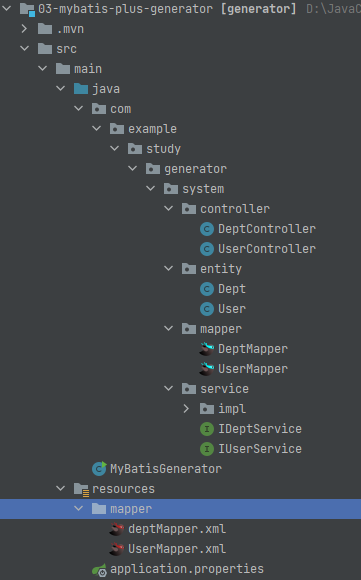

#  mybatis-plus笔记

## 1、什么是MyBatis-plus？

[MyBatis-Plus](https://github.com/baomidou/mybatis-plus)（简称 MP）是一个 [MyBatis](https://www.mybatis.org/mybatis-3/)的增强工具，在 MyBatis 的基础上只做增强不做改变，为简化开发、提高效率而生。

* 无侵入：只做增强不做改变，引入它不会对现有的工程产生影响
* **损耗小**：启动即会自动注入基本 CURD，性能基本无损耗，直接面向对象操作
* **强大的 CRUD 操作**：内置通用 Mapper、通用 Service，仅仅通过少量配置即可实现单表大部分 CRUD 操作，更有强大的条件构造器，满足各类使用需求
* **支持 Lambda 形式调用**：通过 Lambda 表达式，方便的编写各类查询条件，无需再担心字段写错
* **支持主键自动生成**：支持多达 4 种主键策略（内含分布式唯一 ID 生成器 - Sequence），可自由配置，完美解决主键问题
* **支持 ActiveRecord 模式**：支持 ActiveRecord 形式调用，实体类只需继承 Model 类即可进行强大的 CRUD 操作
* **支持自定义全局通用操作**：支持全局通用方法注入（ Write once, use anywhere ）
* **内置代码生成器**：采用代码或者 Maven 插件可快速生成 Mapper 、 Model 、 Service 、 Controller 层代码，支持模板引擎，更有超多自定义配置等您来使用
* **内置分页插件**：基于 MyBatis 物理分页，开发者无需关心具体操作，配置好插件之后，写分页等同于普通 List 查询
* **分页插件支持多种数据库**：支持 MySQL、MariaDB、Oracle、DB2、H2、HSQL、SQLite、Postgre、SQLServer 等多种数据库
* **内置性能分析插件**：可输出 SQL 语句以及其执行时间，建议开发测试时启用该功能，能快速揪出慢查询
* **内置全局拦截插件**：提供全表 delete 、 update 操作智能分析阻断，也可自定义拦截规则，预防误操作

## 2、快速开始

### 1、创建数据库表，插入相关的数据

```sql
DROP TABLE IF EXISTS user;
CREATE TABLE user
(
    id BIGINT(20) NOT NULL COMMENT '主键ID',
    name VARCHAR(30) NULL DEFAULT NULL COMMENT '姓名',
    age INT(11) NULL DEFAULT NULL COMMENT '年龄',
    email VARCHAR(50) NULL DEFAULT NULL COMMENT '邮箱',
    PRIMARY KEY (id)
);
DELETE FROM user;
INSERT INTO user (id, name, age, email) VALUES
(1, 'Jone', 18, 'test1@baomidou.com'),
(2, 'Jack', 20, 'test2@baomidou.com'),
(3, 'Tom', 28, 'test3@baomidou.com'),
(4, 'Sandy', 21, 'test4@baomidou.com'),
(5, 'Billie', 24, 'test5@baomidou.com');
```

### 2、创建SpringBoot项目，引入相关的依赖

```xml
<!-- 引入mybaits的依赖-->
<dependency>
    <groupId>com.baomidou</groupId>
    <artifactId>mybatis-plus-boot-starter</artifactId>
    <version>3.5.0</version>
</dependency>
<!-- 引入mysql数据库连接的依赖-->
<dependency>
    <groupId>mysql</groupId>
    <artifactId>mysql-connector-java</artifactId>
</dependency>
```

### 3、在application.xml文件中配置数据库连接信息

```yml
spring:
  datasource:
    username: root
    password: 252525
    driver-class-name: com.mysql.jdbc.Driver
    url: jdbc:mysql://localhost:3306/mybatisplus
```

### 4、在SpringBoot项目启动项添加@MapperScan注解扫描mapper文件

```java
@SpringBootApplication
@MapperScan(basePackages = "com.ls.study.mapper")
public class SpringBootApplicationMain {
    public static void main(String[] args) {
       SpringApplication.run(SpringBootApplicationMain.class, args);
    }
}
```

### 5、创建相关实体类

```java
@Data
public class User {
    private Integer id;
    private String name;
    private String email;
    private Integer age;
}
```

### 6、创建对应的Mapper类继承BaseMapper

```java
@Mapper
public interface UserMapper extends BaseMapper<User> {
}
```

7、编写测试类，进行功能测试

```java
@SpringBootTest
@DisplayName("测试mybatis-plus的相关方法")
public class MyTest {
    @Autowired
    UserMapper mapper;

    @DisplayName("测试查询所有数据的方法")
    @Test
    public void test() {
        List<User> userList = mapper.selectList(null);
        userList.forEach(System.out::println);
    }
}
```

## 3、MyBatis-plus的相关注解说明

### @TableName：

* 表名注解，标识实体类对应的表，使用位置：实体类

**在MyBatis-plus中默认操作的是实体类同名的数据库表，当实体类的类名和数据库中的表的表名不一致的时候，就需要使用@TableName注解，标识该类对应的数据库中的哪张表**

```java
@TableName("t_user") //标识User类对应的是数据库中的t_user这张表
public class User {
    private Integer id;
    private String name;
    private String email;
    private Integer age;
}
```

### @TableId：

- 描述：主键注解
- 使用位置：实体类主键字段

```java
@TableName("sys_user")
public class User {
    @TableId(value = "id",type = IdType.AUTO)
    private Long id;
    private String name;
    private Integer age;
    private String email;
}
```

| 属性  | 类型   | 必须指定 | 默认值      | 描述         |
| :---- | :----- | :------- | :---------- | :----------- |
| value | String | 否       | ""          | 主键字段名   |
| type  | Enum   | 否       | IdType.NONE | 指定主键类型 |

@TableId注解type属性的可选值如下,一般数据库设置了主键自增的话都是使用`IdType.AUTO`

```java
public enum IdType {
    AUTO(0), //数据库ID自增
    NONE(1),//该类型未设置主键类型
    INPUT(2),//insert前自行set主键值
    ASSIGN_ID(3), //分配 ID(主键类型为 Number(Long 和 Integer)或 String)(since 3.3.0),使用接口IdentifierGenerator的方法nextId(默认实现类为								DefaultIdentifierGenerator雪花算法)
    ASSIGN_UUID(4); //分配 UUID,主键类型为 String(since 3.3.0),使用接口IdentifierGenerator的方法nextUUID(默认 default 方法)
    private final int key;
    private IdType(int key) {
        this.key = key;
    }
    public int getKey() {
        return this.key;
    }
}
```

### @TableField

* 描述：字段注解（非主键列）

使用@TableFiled注解用来标识该属性对应表中的哪个字段名

@TableFiled(exist=false)注解表示在表中不存在该字段，无需进行赋值

```java
@TableName("sys_user")
public class User {
    @TableId
    private Long id;
    @TableFiled("nickname")
    private String name;
    private Integer age;
    private String email;
    @TableField(exist = false)
    private double salary;
}
```

## 4、使用MyBatis-plus中的一些注意点

### 1、==在MyBatis-plus中如果通过实体类查询数据，默认是可以将查询到的数据的主键值封装到查询对象返回的，这和原生的MyBatis不同，MyBatis需要使用UseGeneratorKey和KeyProperty属性来达到同样的效果==

### 2、SpringBoot项目在集成MyBatis-plus的同时，如果有自定义的mapper.xml配置文件,默认放在resources文件夹下面的mapper目录下，是可以被解析到的

### 3、不需要指定mybatis-plus.mapper-locations: classpath:myMapper/*.xml,如果文件夹的名字不叫mapper的话，那么就需要指定mapper映射文件的位置

### 4、特别需要注意的是：如果我们用到了分页的方法的话，我们需要配置和注册插件，向插件中添加分页插件，不然的话不会生效！！！！！

```java
@Bean
public MybatisPlusInterceptor mybatisPlusInterceptor() {
    MybatisPlusInterceptor interceptor = new MybatisPlusInterceptor();
    //添加分页插件
    interceptor.addInnerInterceptor(new PaginationInnerInterceptor(DbType.MYSQL));
    return interceptor;
}
```

### 5、如果使用了分页插件的话，返回的信息会封装到Page对象中，可以查看相关的信息

```java
@Controller
@RequestMapping("/system/user")
@Slf4j
public class UserController {
    @Autowired
    IUserService userService;
    @GetMapping("/page")
    @ResponseBody
    public List<User> getPageInfo() {
        Page<User> page=new Page<>(1,2);
        Page<User> userPage = userService.getBaseMapper().selectPage(page, null);
        log.info("分页的总条数:{}",page.getTotal());
        log.info("当前页码:{}",page.getCurrent());
        log.info("总页码:{}",page.getPages());
        log.info("每页显示的条数:{}",page.getSize());
        log.info("是否还有下一页:{}",page.hasNext());
        log.info("是否有上一页:{}",page.hasPrevious());
        return userPage.getRecords();
    }
}
```

## 5、全局配置实体类的策略配置

很多的实体类都需要配置主键策略和@TableName指定映射表，如果实体类和表名的差别有统一的前缀的话可以使用如下配置

```yaml
# 注入全局MP策略配置
mybatis-plus:
  global-config:
    db-config:
      id-type: auto # 配置全局的主键策略
      table-prefix: # 配置全局的表映射前缀
```

## 6、Mybatis-plus继承BaseMapper的相关测试

```java
@SpringBootTest
@DisplayName("测试mybatis-plus的相关方法")
public class MyTest {
    @Autowired
    UserMapper mapper;

    @DisplayName("测试查询所有数据的方法")
    @Test
    public void test() {
        List<User> userList = mapper.selectList(null);
        userList.forEach(System.out::println);
    }

    @DisplayName("测试插入数据-插入实体中不为空的字段")
    @Test
    public void testInsert() {
        User user = new User();
        user.setAge(18);
        user.setSalary(20.8);
        int insert = mapper.insert(user);
        System.out.println("插入的数据的主键值:" + user.getId());
        Assertions.assertEquals(1, insert);
    }

    @DisplayName("通用的更新操作--默认更新非空字段")
    @Test
    public void testUpdate() {
        User user = new User();
        user.setId(8);
        user.setName("修改名字");
        user.setEmail("xiugai@qq.com");
        int result = mapper.updateById(user);
        Assertions.assertEquals(1, result);
    }

    @DisplayName("通用的查询操作--通过id查询数据")
    @Test
    public void testSelect() {
        /*单条件查询数据*/
        User user = mapper.selectById(8);
        System.out.println(user);
    }

    @DisplayName("通用的查询操作--通过wrapper封装实体查询数据信息")
    @Test
    public void testSelectActive() {
        /*通过多个列记性查询， id + name进行查询*/
        User user = new User();
        user.setId(9);
        user.setName("Lucy");
        Wrapper wrapper = new QueryWrapper(user);
        User result = mapper.selectOne(wrapper);
        System.out.println(result);
    }
    @DisplayName("通用的查询操作--通过多个id进行查询")
    @Test
    public void testBatchSelect(){
        List<User> userList = mapper.selectBatchIds(Arrays.asList(7, 8, 9));
        userList.forEach((user)->{
            System.out.println(user);
        });
    }

    @DisplayName("通用的查询操作--通过Map进行查询")
    @Test
    public void testSelectByMap(){
        //查询条件为name为Lucy且年龄为18岁的用户信息
        Map<String,Object> map=new HashMap<>();
        //map中的key应该写数据库中的列名，按照map中的key去查询数据信息
        map.put("name","Lucy");
        map.put("age",18);
        List<User> userList = mapper.selectByMap(map);
        userList.forEach(user-> System.out.println(user));
    }

    @DisplayName("通用的查询操作--分页进行数据查询")
    @Test
    public void testByPage(){
        //分页查询
        Page page=new Page(2,5);
        Page selectMapsPage = mapper.selectPage(page, null);
        long total = selectMapsPage.getTotal();
        System.out.println("一共有:"+total);
    }
}
```

## 7、MyBatis-plus中的条件构造器

1. 这是Wrapper抽象类的继承结构图，我们使用的是QueryWrapper，其他的AbstractWrapper是抽象类，而下面的EmptyWrapper是Wrappers中的私有静态内部类


2. 相关的测试方法

```java
@SpringBootTest
@SuppressWarnings("all")
public class TestQueryWrapper {
    @Autowired
    UserMapper userMapper;

    @Autowired
    DeptMapper deptMapper;

    @DisplayName("条件构造器--queryWrapper构造条件查询")
    @Test
    public void testQueryWrapper(){
        //分页查询年龄18--25岁的姓名为kyrie的所有用户
        //1.封装查询条件,column必须写的是数据库中的列名
        QueryWrapper wrapper=new QueryWrapper();
        wrapper.between("age",18,25);
        wrapper.eq("name","kyrie");
        //2.分页查询指定条件数据
        Page page = userMapper.selectMapsPage(new Page<>(2, 1), wrapper);
        //3.获取查询到的数据列表
        page.getRecords().forEach((user)-> System.out.println(user));
    }


    @DisplayName("测试使用maper映射文件的方式查询数据")
    @Test
    public void getDept(){
        Dept dept = deptMapper.getDept(1);
        System.out.println(dept);
    }

    @DisplayName("条件构造器--queryWrapper构造模糊查询")
    @Test
    public void testLike(){
        //查询姓名中有'L'的，或者是年龄大于25岁的用户信息
        QueryWrapper<User> wrapper=new QueryWrapper<>();
        wrapper.like("name",'L');
                //.or() //SQL:SELECT id,name,email,age FROM user WHERE (name LIKE ? OR age > ?)
                //.or((condition)->condition.gt("age",25)); //SQL: SELECT id,name,email,age FROM user WHERE (name LIKE ? OR (age > ?)) 嵌套查询
        List<User> users = userMapper.selectList(wrapper);
        for (User user : users) {
            System.out.println(user);
        }
    }
}
```

## 8、MyBatis中使用Active Record

**仅仅需要让实体类继承Model类并且实现主键指定的方法，就可以使用AR了**

但是！，我发现却不止是这样，如果只是以下的配置的话，那么使用实体进行查询的时候会出现以下的异常信息，解决的办法就是引入实体类对应的mapper信息！！

com.baomidou.mybatisplus.core.exceptions.MybatisPlusException: com.example.hello.domain.User Not Found TableInfoCache.

```java
@Data
public class User extends Model<User> {
    @TableId(value="id",type=IdType.AUTO)
    private Integer id;
    private String name;
    private String email;
    private Integer age;
    @TableField(exist = false)
    private double salary;
    /**
     * 指定当前实体类的主键属性
     * @return
     */
    @Override
    public Serializable pkVal() {
        return id;
    }
}
```

引入实体对应的mapper类

```java
@Mapper
public interface UserMapper extends BaseMapper<User> {
}
```

基本的相关测试

```java
@SpringBootTest
@DisplayName("测试AR相关的功能")
class HelloApplicationTests {

    @Autowired
    private UserMapper mapper;
    @Test
    void contextLoads() {
        System.out.println("获取的mapper:"+mapper);
    }
    @DisplayName("AR插入操作")
    @Test
    public void test1(){
        User user=new User();
        user.setName("宋红康老师");
        user.setAge(19);
        user.setEmail("songhk@qq.com");
        boolean insert = user.insert();
        Assertions.assertEquals(true,insert);
    }

    @DisplayName("AR获取所有的数据")
    @Test
    public void testSelect(){
        User user=new User();
        List<User> userList = user.selectAll();
        userList.forEach(System.out::println);
    }

}
```

## 9、使用代码生成器

引入相关的依赖信息

```xml
<!--引入生成器的依赖-->
<dependency>
    <groupId>com.baomidou</groupId>
    <artifactId>mybatis-plus-generator</artifactId>
    <version>3.5.1</version>
</dependency>
<!--引入Velocity模板，MP的默认模板引擎-->
<dependency>
    <groupId>org.apache.velocity</groupId>
    <artifactId>velocity-engine-core</artifactId>
    <version>2.1</version>
</dependency>
```

编写生成代码类

```java
public class MyBatisGenerator {
    public static void main(String[] args) {
        FastAutoGenerator.create("jdbc:mysql://localhost:3306/mybatisplus", "root", "252525")
                //1. 全局配置
                .globalConfig(builder -> {
                    builder.author("kyrie") // 设置作者
                            .enableSwagger() // 开启 swagger 模式
                            .fileOverride() // 覆盖已生成文件
                            .outputDir("D:\\JavaCode\\MyBatis-Plus\\03-mybatis-plus-generator\\src\\main\\java"); // 指定输出目录
                })
                //2.包配置相关
                .packageConfig(builder -> {
                    builder.parent("com.example.study.generator") // 设置父包名
                            .moduleName("system") // 设置父包模块名
                            .pathInfo(Collections.singletonMap(OutputFile.mapperXml, "D:\\JavaCode\\MyBatis-Plus\\03-mybatis-plus-generator\\src\\main\\resources\\mapper")); // 设置mapperXml生成路径
                })
                //3.策略配置相关
                .strategyConfig(builder -> {
                    builder.addInclude("user","dept") // 设置需要生成的表名
                            .addTablePrefix("");// 设置过滤表前缀
                })
                .templateEngine( new VelocityTemplateEngine()) // 使用Freemarker引擎模板，默认的是Velocity引擎模板
                .execute();

    }
}
```

生成的目录结构图如下所示



## 10、插件机制

简单的介绍几个插件：分页插件，防止全表更新和删除插件，性能分析插件，使用SpringBoot用如下方式注入到容器中，具体的信息还是得看官网如何使用

```java
@Configuration
public class MyBatisPlusConfig {
    @Bean
    public MybatisPlusInterceptor mybatisPlusInterceptor() {
        MybatisPlusInterceptor interceptor = new MybatisPlusInterceptor();
        //注册分页插件
        interceptor.addInnerInterceptor(new PaginationInnerInterceptor(DbType.MYSQL));
        //防止全表更新和删除插件
        interceptor.addInnerInterceptor(new BlockAttackInnerInterceptor());
        //性能分析插件
        interceptor.addInnerInterceptor(new IllegalSQLInnerInterceptor());
        return interceptor;
    }
}
```